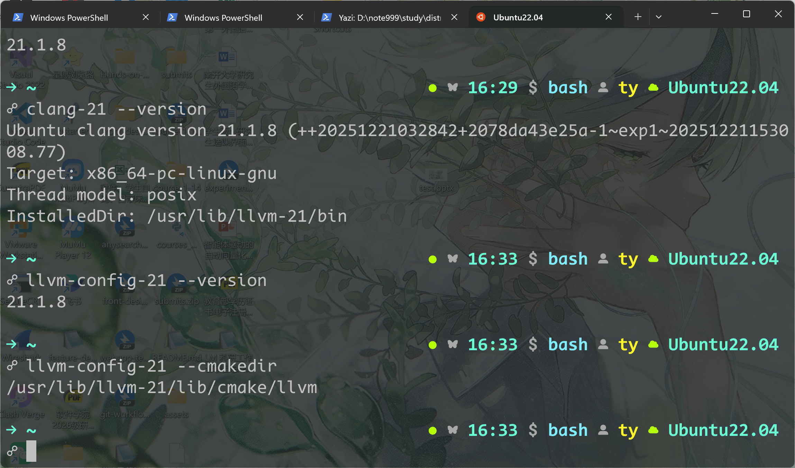
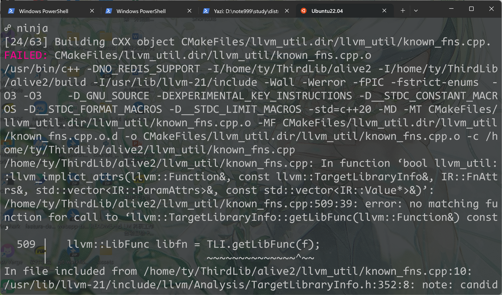
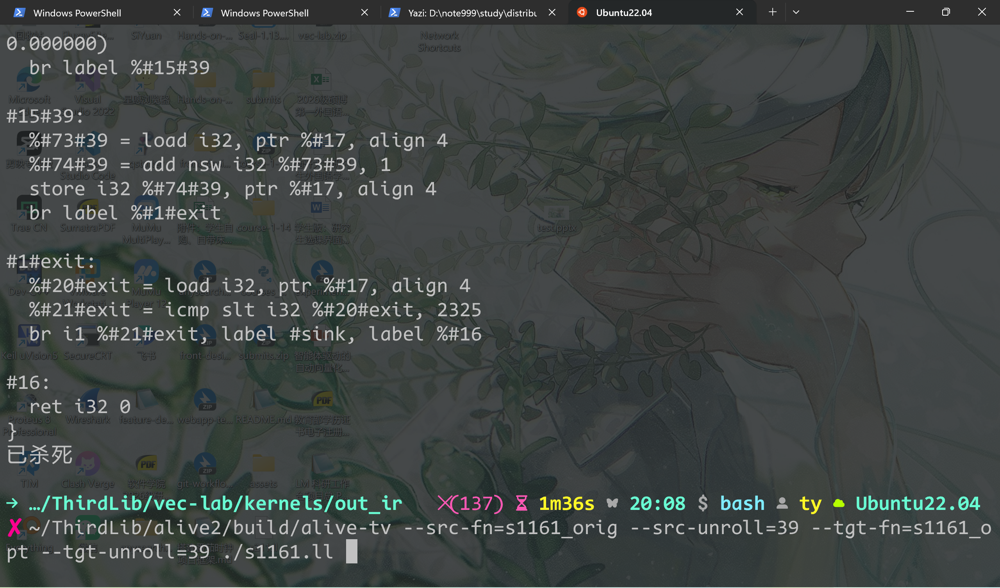
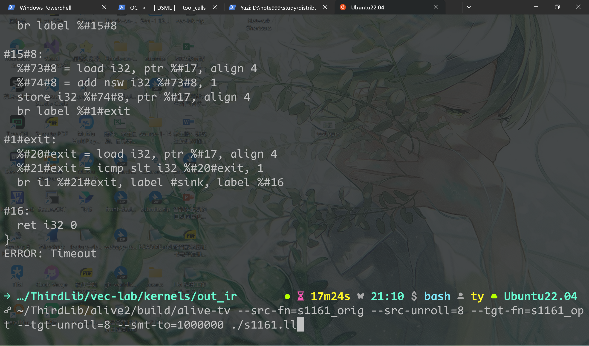
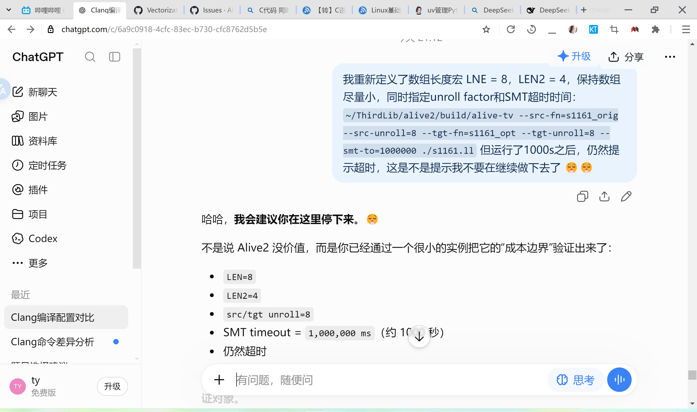

# alive2 形式化证明

> 摘自个人笔记，语言粗俗~
> 最终没有通过alive-tv实现形式化证明(timeout)，或许可以当做个安装向导

## build

在线版实在难用，这是我最后的尝试了。

```bash
sudo apt update
# 安装依赖，一般都是有 gcc 和 cmake
sudo apt install ninja-build re2c z3

git clone git@github.com:AliveToolkit/alive2.git
cd alive2
mkdir build
cmake -GNinja -DCMAKE_BUILD_TYPE=Release ..
ninja # 大概十几到几十秒的时间
```

但这个编译出个四不像的`alive`​出来，我们需要的是`alive-tv`
> 此处后缀`-tv` 表示 **翻译验证(translation validation)** 

---

又要安装LLVM 21（最新的release note提示兼容LLVM 21），发现这个牢Ubuntu中居然有一个LLVM 14，我估计是之前（大一大二可能）装clangd时搞得

```bash
# 使用官方的安装脚本，大概应该是给apt添加源，然后安装
wget https://apt.llvm.org/llvm.sh
chmod +x llvm.sh
sudo ./llvm.sh 21

# 或者在添加源后手动安装
sudo apt update
sudo apt install \
    clang-21 \
    llvm-21 \
    llvm-21-dev \
    llvm-21-tools
```



---

```bash
cd ~/ThirdLib/alive2
rm -rf build
mkdir build
cd build

cmake -GNinja \
    -DLLVM_DIR=/usr/lib/llvm-21/lib/cmake/llvm \
    -DBUILD_TV=1 \
    -DCMAKE_BUILD_TYPE=Release \
    ..
```

第一次构建提示缺失`zstd`，直接安装：

```bash
sudo apt update
sudo apt install libzstd-dev
```

`cmake`​通过，但执行`ninja`遇到LLVM API不匹配的问题：



原因是因为`git clone`默认拉去最新的代码仓库（而不是最新的release），而最新的源码：

> 最新版本的 Alive2 始终 intended to be built against the latest version of LLVM，使用 LLVM GitHub 的 `main` 分支。

因此我这里采用回退alive2的方式：

```bash
git checkout v21.0
```

然后，就可以正常构建出alive2

> 构建时主要注意版本匹配问题：
>
> 1. alive2-tv 要与 llvm 版本匹配
> 2. alive2-tv 只能验证特定llvm版本生成的IR

## test

```bash
~/ThirdLib/alive2/build/alive-tv --src-fn=s1161_orig --src-unroll=39 --tgt-fn=s1161_opt --tgt-unroll=39 ./s1161.ll
```

`unroll factor`小于39，提示ERROR，跑不到边界；大于等于，跑满CPU，被系统kill



这里问了ds，数组长度`LEN`​和`LEN2`​是**几乎**可以任意小的，但是注意`LEN2`​没有`#ifndef`条件守卫（因此要改源码，`-D`会重定义宏）

```bash
☍ clang -O0 -march=native -S -emit-llvm -DTYPE=double -DLEN=8 -DLEN2=4 -I.. s1161.c -o
out_ir/s1161.ll
In file included from s1161.c:8:
../common.h:21:9: warning: 'LEN2' macro redefined [-Wmacro-redefined]
#define LEN2 256
        ^
<command line>:3:9: note: previous definition is here
#define LEN2 4
        ^
1 warning generated.
```

改了之后：`LEN = 16, LEN2 = 4`​，`alive-tv`​又提示`timeout`

通过`alive-tv --help | grep -i "timeout"`可以看到超时时间配置的参数，默认10s，改成100s，依旧：

```bash
ERROR: Timeout
```

再把数组改小一点试试：`LEN = 8, LNE2 = 4`

```bash
# 此处 unroll factor 指定与 LNE 相等，以免：
# ERROR: The source program doesn't reach a return instruction.
# Consider increasing the unroll factor if it has loops
~/ThirdLib/alive2/build/alive-tv --src-fn=s1161_orig --src-unroll=8 --tgt-fn=s1161_op
t --tgt-unroll=8 --smt-to=100000 ./s1161.ll
```

在给超时时间加一个`0`，不行我就真不搞了：



放弃



最后一个问题，论文（如LLM vectorizer、VecTrans）中是怎样实现的：

> LLM-Vectorizer： 他们在 TSVC 上使用 Alive2，并通过一些 **domain-specific techniques to improve the scalability of Alive2**；最终只有 **38.2%**  的 vectorizations 被验证为 correct。

放弃尝试！

## summary

手动编译了一个`alive-tv`，除了通过`alive-tv --help`了解了更多的选项和使用方式，不妨碍它继续超时；

不过也不算白忙。